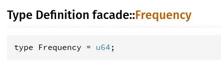
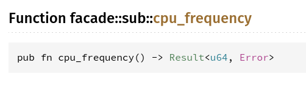

# Minimal example for Rust bug [#15823](https://github.com/rust-lang/rust/issues/15823)

> Re-exported type aliases are not preserved in function signatures

## Problem

1. `utils` crate contains type alias `type Frequency = u64`
2. `sub` crate uses `utils` crate and exposes `fn cpu_frequency() -> io::Result<Frequency>`
3. `facade` crate aggregates all these crates and reexports both type alias and function
4. `rustdoc` fails to use `Frequency` type alias for re-exported `cpu_frequency` function

This behavior was tested both with Rust `1.41.0-stable`
and `1.43.0-nightly (7760cd0fb 2020-02-19)`

